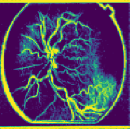
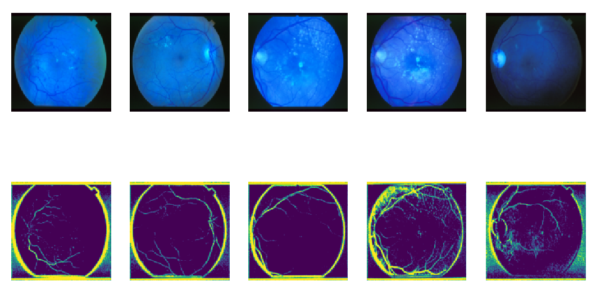
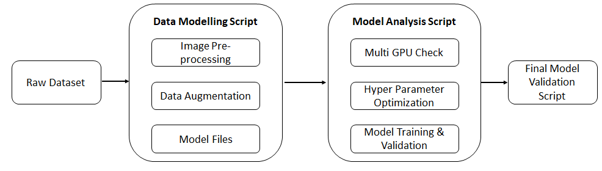
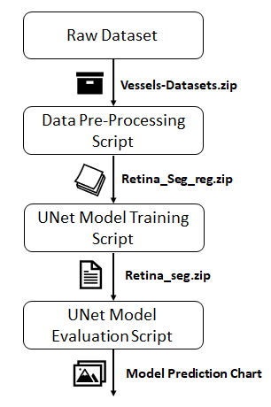

<!-- PROJECT LOGO -->
<br />
<p align="center">
  

  <h2 align="center">VesselSegNet:A Deep Learning Framework for Autonomous Retinal Blood Vessel Segmentation on Fluorescein Angiography Scans</h2>
  <p align="center">
  By: <strong> Vishal Balaji Sivaraman </strong>
  </p>
</p>

## Introduction

The proposed study emphasizes the need of distinguishing and segmenting retinal blood vessels scattered across the retina by using a novel model framework known as hypertuned UNet. In addition, the paper demonstrates and explores the benefits of the suggested technique on a wide range of exceptional fundus scan datasets. Finally, the research also illustrates the benefits of training and testing the proposed hypertuned model Unet framework on a multi-GPU platform. 




#### Note: Due to the size of generated output & model files, I have taken the liberty of compressing the files into a zipfile and provided a url for accessing the same inorder to execute the script with ease .Kindly do the needfull.

## Contents

The presented project repository comprises of  three vital folders titled 'Project PPT', 'Project Report' & 'Project Scripts & Code', where the folder titled Project PPT includes the ppt and pdf copies pertaining to the project, while the folder titled 'Project Report' houses a pdf copy of the project and finally the folder titled 'Project Scripts & Code' features the scripts for training and validating the proposed hypertuned UNet Model Framework and an eenvironemnt.yml file which installs the required dependencies for initiaiting the process.

## Algorithm Overview

The proposed model framework is comprised of three distinct scripts labeled 'Retina_Segmentation_Data_Pre_processing', 'Retina_Segmentation_TF', and 'Retina_Segment_Eval_Script'. In addition, the previously indicated inventory of scripts can be found in the folder titled 'Project Scripts & Code'. To provide a general overview of the functions conducted by each script.

* ```Retina_Segmentation_Data_Pre_processing.ipynb```: The script is entitled to perform data modelling and augmentation
* ```Retina_Segmentation_TF.ipynb```: This script is entitled to perform model training and validation
* ```Retina_Segment_Eval_Script.ipynb```: This script aims to perform final model validation or real time validation ie. record the performance of the model upon introducing the model to an unknown dataset.

Last but not least, a copy of the algorithm design and workflow chart is provided below to elaborate more on the function and input file requirements for effectively completing each stage in the proposed model framework.  

<p align="center">
  <h3 align="center">Algorithm Design Chart</h3>
<p align="center">
  
</p>
</p>
  
<br />

<p align="center">
  <h3 align="center">Algorithm Workflow Chart</h3>
<p align="center">
  
</p>
</p>

<!-- GETTING STARTED -->
## Getting Started

### Dependencies

This project was run in the a custom kernel housing all the dependencies mentioned below.

* Albumentations 1.2.1
* NumPy 1.22.4
* Pandas 1.5.3
* Matplotlib 3.7.1
* OpenCV 4.7.0.72
* Tensorflow 2.12.0
* Torch 2.0.0

Alternative Approach: The project scripts titled 'Retina_Segmentation_Data_Pre_processing.ipynb' & 'Retina_Segmentation_TF.ipynb' can be excuted in the Tensorflow-2.4.1 kernel on HiPerGator while the validation script titled 'Retina_Segment_Eval_Script.ipynb' can be excuted in colab with ease.  

### Memory Requirements
The scripts were run in a bespoke environment with 100 GB of RAM, two CPU cores, and five GPU cores. However, the proposed scripts titled 'Retina_Segmentation_Data_Pre_processing.ipynb' and 'Retina_Segment_Eval_Script.ipynb' consume less resources while performing their tasks and thus can be executed on a custom environment with minimal resources, whereas the script titled 'Retina_Segmentation_TF.ipynb' requires a significant portion of resourcesinorder to perform complex compuutataions with ease , thus requiring a custom environment with moderate resources for optimal performance.


**Memory Summary**

* ```Retina_Segmentation_Data_Pre_processing.ipynb```: For optimal performance, a minimum of 16 GB RAM, 2 cores, and a single GPU core are required.
* ```Retina_Segmentation_TF.ipynb```: For optimal performance, a minimum of 40-50 GB RAM, two CPUs, and at least two GPU cores are required.
* ```Retina_Segment_Eval_Script.ipynb```: For optimal performance, a minimum of 16 GB RAM, 2 cores, and a single GPU core are required.

### Installation

1. Clone the repo
   ```sh
   git clone https://github.com/uf-eel6825-sp23/final-project-code-VishalBalajiSivaraman.git
   ```
2. Setup (and activate) your environment

### Execution

**Download the input & model files [here](https://drive.google.com/file/d/10N6xBrecGXnHAZDsWzcvyA9nt0kLoHwn/view?usp=share_link).**

**File Descriptions**
* ```Vessels-Datasets.zip```: This zip file contains the raw dataset and its contents, which must be modelled and enriched using the 'Retina_Segmentation_Data_Pre_processing.ipynb' script.. 
* ```Retina_Seg_reg.zip```: This zip file comprises of the Processed Dataset and model initialization files needed for training and verifying the proposed model in the script 'Retina_Segmentation_TF.ipynb'..
* ```Retina_seg.zip```: This zip file comprises the Processed Datasets (including the validation database) and the model parameters file needed for final model or real-time validation using the 'Retina_Segment_Eval_Script.ipynb' script.

### TroubleShooting Tips: 

####   In the event of any 
       * dependency errors encountered during installation of the aformentioned list of libraries.
       * import errors encountered during initiallization of any of the aforementioned scripts.
       
#### I would kindly request that you switch the execution approach to the aformentioned technique titled **Alternative Approach**
 
#### For any additional issues (particularly run time errors), kindly restart the kernel and execute all of the cells.

<!-- Authors -->
## Authors

* Vishal Balaji Sivaraman - vishalbalaji.sivaraman@medicine.ufl.edu.

## Thank you
